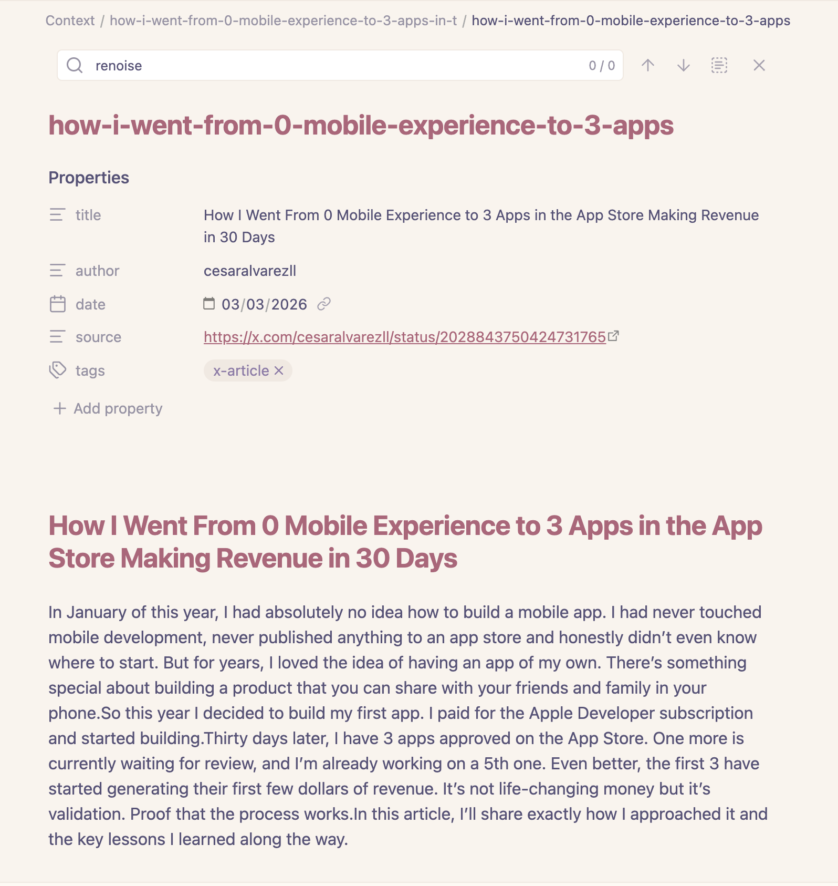
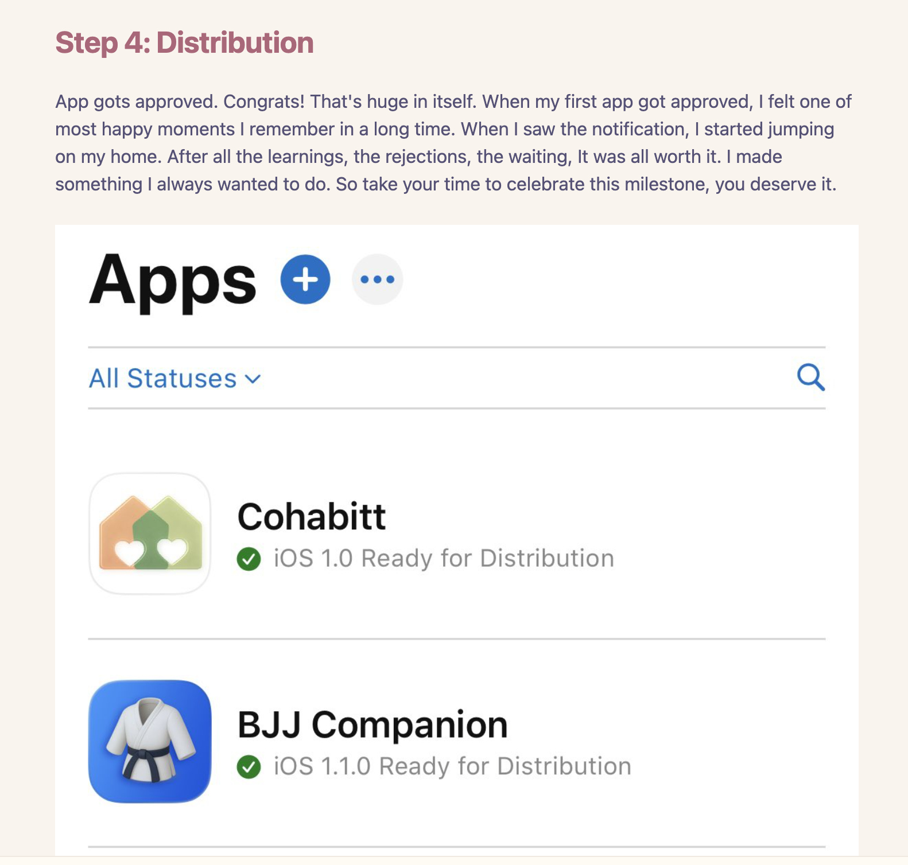

# X to Obsidian

I quite often find good stuff on X that I want to use for inspiration for content ideas or improving my internal processes; sometimes it's just a piece of the article, sometimes is the general idea, but when I was copying and pasting from X into my obsidian I had to do repetitive markdown fomatting I felt a really bad taste in my mouth about my precious time being wasted. 

So I built a tiny Chrome/Brave extension that does one blunt, practical thing: it converts an X.com article into an Obsidian-friendly Markdown file. One click, a clean `.md`, ready to drop into a vault.


When the file lands in the vault, it keeps the stuff that makes knowledge bases useful: metadata you can query later. Title. Author. Date. Source. Tags. The boring scaffolding that turns a pile of text into something you can work with.



And yes, it preserves the body in readable Markdown, the images are linked automatically in the original places.



## Installation

1. **Download the extension**
   - Clone this repository or download it as a ZIP file and extract it
   ```bash
   git clone https://github.com/jgonzalezd/x-article-2-obsidian-md.git
   ```

2. **Load in Chrome/Brave**
   - Open Chrome/Brave and go to `chrome://extensions/`
   - Enable **Developer mode** (toggle in the top right)
   - Click **Load unpacked**
   - Select the extension folder (`xpost2md`)

3. **Use it**
   - Navigate to any X.com article
   - Click the extension icon in your browser toolbar
   - Click **Convert to Markdown**
   - A `.zip` file will download containing the markdown file and images
   - Extract and move to your Obsidian vault

If you're a heavy Obsidian user, you'll appreciate this extension and use it almost daily.

